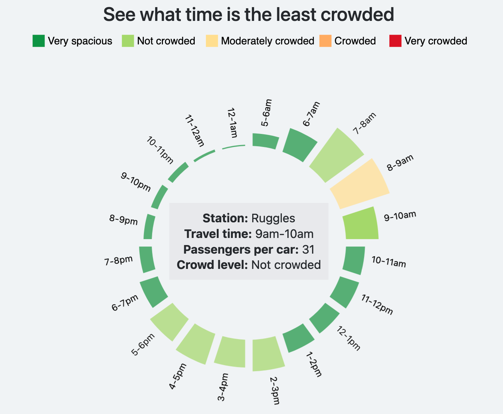

# MBTA Subway Crowding Dashboard
Author: Sihang Sun

MBTA Subway Crowding Dashboard is an online interactive dashboard that provides MBTA subway crowding information. The dashboard allows users to discover a station's crowding information at various times, on different days of the week, view the crowding simulation for your subway car, as well as the crowd levels throughout a trip.

The data shown on the dashboard are crowding metrics calculated using MBTA ridership data provided by KORBATO.

The project hopes to achieve the goal of providing riders with the useful crowding information they need to better plan their trips.

[Project write-up](https://sihang-tech2.github.io/final_development/doc.html)

